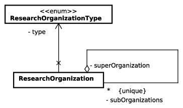
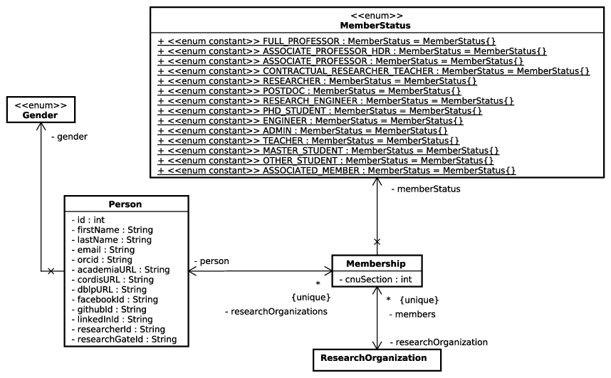

# Research Laboratory Online Management Tools

This project is the backend implementation of the online tools for managing the database of a research laboratory.

## 1. Documentation for Developpers

The **documentation for the contributors and developpers** is in the [CONTRIBUTING document](./CONTRIBUTING.md).

## 2. Model Definition

The model of the application is based on the definition of JEE entities that represent the data managed by the software.

### 2.1 Research Organizations

Research organizations are structure that have the role to do Research tasks. They may by *universities*, *faculties*, *laboratories*, *teams*, etc.
A research origanisation has several information associated to it: acronym, name, description, url...
It has also a list of members, which are described in Section 2.2.

In addition, a hierarchical structure may exist between different research organizations. Therefore, an organization may be composed of other organizations.



### 2.2 Persons

Persons are involved in a research organization with different possible status (full professor, associate profesor, PhD student...). Each person is associated to different informations (name, gender, email, ORCID number...) that are usually considered for building activity reports for a research unit.

As it is briefly explained in the previous section, a person may be involved in a research organization. The relationship is supported by the concept of *membership*. This membership is for a specific time windows, and for a position (or member status).



### 2.3 Journals

In academic publishing, a (scientific) journal is a periodical publication intended to further the progress of science, usually by reporting new research. Articles in journals are mostly written by active scientists such as students, researchers and professors instead of professional journalists. There are thousands of scientific journals in publication, and many more have been published at various points in the past. Most journals are highly specialized, although some of the oldest journals such as Nature publish articles and scientific papers across a wide range of scientific fields. Scientific journals contain articles that have been peer reviewed, in an attempt to ensure that articles meet the journal's standards of quality, and scientific validity.

Journal ranking is widely used in the evaluation of an academic journal's impact and quality. Journal rankings are intended to reflect the place of a journal within its field, the relative difficulty of being published in that journal, and the prestige associated with it. They have been introduced as official research evaluation tools in several countries.
Consequently, the project consider different ranking scores for the journals:

* *Impact factor* and CiteScore: reflecting the average number of citations to articles published in journals.
* *SCImago Quartile*: Each scientific field of the journals is divided into four quartiles: Q1, Q2, Q3, Q4. Q1 is occupied by the top 25% of journals in the list; Q2 is occupied by journals in the 25 to 50% group; Q3 is occupied by journals in the 50 to 75% group and Q4 is occupied by journals in the 75 to 100% group. This quartile is based on the Scimago Journal Rank (SJR), which is the numeric score associated to the journal.
* *Web-of-Science Quartile* As for Scimago, Web-of-Science also ranks the journals in four different quartiles.

Open access (OA) is a set of principles and a range of practices through which research outputs are distributed online, free of access charges or other barriers. Several journals are OA and others are not. This information is stored into the journal entity.


### 2.4 Publications

Academic publishing is the subfield of publishing which distributes academic research and scholarship. Most academic work is published in academic journal articles, conferences, books or theses. Most scientific and scholarly journals, and many academic and scholarly books, though not all, are based on some form of peer review or editorial refereeing to qualify texts for publication. Different types of academic publishing may be condidered, including:

* Academic paper (also called scholarly paper), which is in academic journals or conferences, and contains original research results or reviews existing results or shows a totally new invention;
* Position paper, an essay that represents the author's opinion;
* Thesis or dissertation, a document submitted in support of a candidature for a degree or professional qualification, presenting the author's research and findings;
* Book or book chapters.


Consquently, a publication (i.e., the result of an academic publishing) is associated to several information, such as its title, abstract text, keywords, DOI number, etc. Each publication is also associated to an ordered list of persons, who are considered as authors (through the `Authorship` type). EAch publication has also a type as defined in the following table.

| Type                | Scopes                            |
| --------------------|-----------------------------------|
| Journal paper       | International or national         |
| Conference paper    | International or national         |
| Oral communication  | International or national         |
| Poster              | International or national         |
| Book                | International or national         |
| Book chapter        | International or national         |
| Journal editing     | International or national         |
| Keynote             | International or national         |
| Thesis              | HDR, PhD, Master                  |
| Patent              | International, european, national |
| Artistic production | Theory of Art                     |
| Reports             | Tech., transfert, documentation   |
| Research tools      | Software...                       |


Each publication type is associated to a category that is defined by the French research agencies (ANR, HCERES, CNU): 

* ACL: Articles in international or national journals with selection commitee and ranked in international databases.
* ACLN: Articles in international or national journals with selection committee and not ranked in international databases.
* ASCL: Articles in international or national journals without selection committee.
* C_ACTI: Papers in the proceedings of an international conference.
* C_ACTN: Papers in the proceedings of a national conference.
* C_COM: Oral Communications without proceeding in international or national conference.
* C_AFF: Posters in international or national conference.
* OS: Scientific books.
* COS: Chapters in scientific books.
* DO: Editor of books or journals.
* C_INV: Keynotes in international or national conference, or seminars.
* TH: HDR, PhD or Master theses.
* PT: Publications for research transfer.
* BRE: Patents.
* OR: Research tools.
* OV: Books for scientific culture dissemination.
* COV: Chapters in a book for scientific culture dissemination.
* PV: Papers for scientific culture dissemination.
* PAT: Artistic research productions.
* AP: Other productions.


## 5. Installation Notes

This section provides some inputs for the installation of this software on a real-life server.

After installing the WAR on the server, and configuring the SQL server, it is important to enable Tomcat to write into the uploadable files.

Let the server path to the upload folder be `/var/www/mysite/Downloadables/` (this folder name is defined in the `application.yml` file).
You must configure Tomcat9 for enabling the writing in this folder. In order to do so, and because Tomcat9 is sandboxed by systemd on Ubuntu operating system, you have to edit the file `/etc/systemd/system/multi-user.target.wants/tomcat9.service'.

In this file, you have to add:
```
[Service]
ReadWritePaths=/var/www/mysite/Downloadables/
```

Then, it is necessary to restart the services:
```
systemctl daemon-reload
systemctl restart tomcat9
```

## 4. Software License

```
Copyright (c) 2019-22, CIAD Laboratory, Universite de Technologie de Belfort Montbeliard
All rights reserved.

This software is the confidential and proprietary information
of the CIAD laboratory and the Université de Technologie
de Belfort-Montbéliard ("Confidential Information").
You shall not disclose such Confidential Information and shall use
it only in accordance with the terms of the license agreement
you entered into with the CIAD-UTBM.

http://www.ciad-lab.fr/
```

